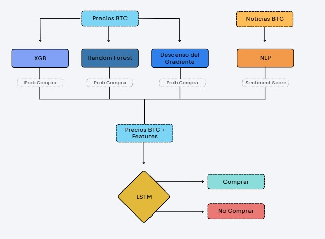
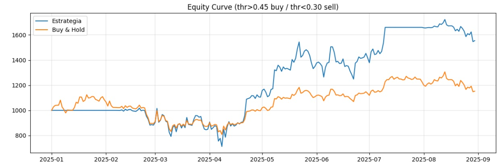

# Neurotrader — Sistema de Trading Algorítmico en BTC/USD



## Descripción General

Este proyecto es el resultado del **Proyecto Final del Bootcamp Big Data & Machine Learning de KeepCoding**.  
Hemos desarrollado un **sistema de trading algorítmico para Bitcoin (BTC/USD)** que combina:

- **Indicadores técnicos** (RSI, MACD, SMA20, EMA20, Bollinger Bands, ATR, CCI).
- **Modelos clásicos de ML** (Random Forest Classifier, SGDClassifier, XGBoost).
- **Análisis de sentimiento** con un modelo de NLP fine-tuneado sobre **FinBERT**.
- **Modelo secuencial BiLSTM con capa de atención**, que integra todas las señales y produce la probabilidad de compra del siguiente día.
- **Backtesting y visualización interactiva** en un **dashboard de Power BI**.
- **Modelos finales 100% funcionales** disponibles en **Huggingface**.
- **Despliegue y Demo del proyecto** disponible en **Streamlit**.

El sistema se entrena con un esquema **rolling mensual con embargo**, simulando un escenario productivo y evitando fugas de información.

---

## Resultados

El **backtesting en 2025 (enero–agosto)** muestra resultados prometedores:  

La estrategia de trading se simuló con un capital inicial de **1.000 USD**, utilizando compras sucesivas de hasta el **10% del equity disponible en cada señal**, con un límite de apalancamiento de **2x** sobre el capital total y aplicando una comisión del **1% por operación**.  
La regla de entrada establece que se realizan compras cuando la probabilidad del modelo **LSTM** supera el umbral de **0,45**, acumulando posiciones hasta el máximo permitido, mientras que se ejecuta la venta de todas las posiciones cuando la probabilidad cae por debajo de **0,35**.  

Durante el período analizado (2025), la estrategia generó un rendimiento acumulado superior al **50%**, frente al **15%** obtenido con un enfoque pasivo de *buy & hold*.  
En términos prácticos, esto significa que el modelo fue capaz de **capturar de forma más eficiente los tramos alcistas del mercado y salir en fases bajistas**, multiplicando por más de tres el resultado del *buy & hold*.



---

## Componentes del Proyecto

### 1. Ingesta y Procesamiento de Datos
- Dataset histórico de BTC/USD (2020–2025) vía Yahoo Finance.
- Cálculo de indicadores técnicos con `finta`.
- Enriquecimiento con etiquetas de subida/bajada (Target).

### 2. Modelos Clásicos
- **RFC (Random Forest Classifier)**: calibrado con Isotonic Regression.
- **SGDClassifier**: entrenado online con `partial_fit()` y calibrado con Platt scaling.
- **XGBoost**: modelo adicional para aportar probabilidad como feature al LSTM.

### 3. Análisis de Sentimiento
- Modelo **FinBERT** fine-tuneado en noticias relacionadas con Bitcoin.
- Devuelve un `sentiment_score` ∈ [0,1].

### 4. Modelo Secuencial
- **BiLSTM con atención**:
  - Dos capas BiLSTM (64 y 32 unidades por dirección).
  - Dropout y normalización para controlar overfitting.
  - Capa de atención para ponderar días relevantes en la ventana.
  - Capa densa final → probabilidad de compra (0–1).
- Entrada: ventanas de 5 días con indicadores, probabilidades calibradas (RFC, SGD, XGB) y sentimiento.

### 5. Backtesting y Dashboard
- Estrategia: comprar si `prob > 0.45`, vender si `prob < 0.35`.
- Dashboard en **Power BI**:
  - KPIs principales (equity final, Sharpe, drawdown, % días en mercado).
  - Comparación del rendimiento de cada modelo.
  - Visualización de trades sobre el precio BTC.

---

## Estructura del Repositorio

```markdown
Neurotrader/
├── backtesting/                        # Archivos relacionados al backtesting que se realizó
├── deeplearning/                       # Carpetas y archivos que contienen el modelo biLSTM con atención
├── machine_learning/                   # Carpetas y archivos que contienen el modelo SGD, RFC y XGBoost
├── nlp/                                # Carpetas y archivos que contienen el modelo NLP
├── notebooks/                          # Copia de todos los notebooks para revisión
├── powerbi/                            # Métricas y resultados obtenidos en archivos .pbix de Power BI
├── Memoria_Tecnica_Neurotrader.pdf     # MoDescripcion de la memoria técnica del proyecto
├── envoroment.yml                      # requerimientos para reproducir el entorno de producción
└── README.md                           # Este documento
```
---

## Modelos Pre-entrenados

Los modelos entrenados (RFC, SGD calibrado, XGBoost, BiLSTM con atención, FinBERT fine-tuneado) están disponibles para descarga en Hugging Face:

- RFC-SGD: https://huggingface.co/kyfer/NeuroTrader-RFC-SGD
- XGBoost: https://huggingface.co/Adrilp01/XGBOOST  
- NLP fine-tuneado: https://huggingface.co/MiguelZazu/finbert 
- BiLSTM con atención: https://huggingface.co/kyfer/NeuroTrader-LSTM

---

## Despliegue y demostración

La demostración del modelo funcional puede vese en: 

---

## Equipo

Proyecto desarrollado por el **Grupo Neurotrader**, en el marco del **KeepCoding Big Data & Machine Learning Bootcamp**.

---

## Licencia

Uso académico. No constituye recomendación financiera.

